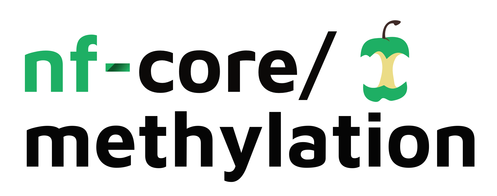

<h1>
  <picture>
    <source media="(prefers-color-scheme: dark)" srcset="docs/images/nf-core-methylation_logo_dark.png">
    
  </picture>
</h1>

[](https://www.nextflow.io/)
[](https://www.docker.com/)


## Introduction

**methylation** is a bioinformatics pipeline that ...

<!-- TODO nf-core:
   Complete this sentence with a 2-3 sentence summary of what types of data the pipeline ingests, a brief overview of the
   major pipeline sections and the types of output it produces. You're giving an overview to someone new
   to nf-core here, in 15-20 seconds. For an example, see https://github.com/nf-core/rnaseq/blob/master/README.md#introduction
-->

<!-- TODO nf-core: Include a figure that guides the user through the major workflow steps. Many nf-core
     workflows use the "tube map" design for that. See https://nf-co.re/docs/contributing/design_guidelines#examples for examples.   -->


0. Prepare reference Genome ([`Bismark`](https://www.bioinformatics.babraham.ac.uk/projects/bismark/)) (Optional) 
1. Merge re-sequenced samples (`cat`)
2. Perform QC ([`FastQC`](https://www.bioinformatics.babraham.ac.uk/projects/fastqc/))
3. Adapter Trimming ([`Trim Galore`](https://www.bioinformatics.babraham.ac.uk/projects/trim_galore/))
4. Align reads to reference genome ([`Bismark`](https://www.bioinformatics.babraham.ac.uk/projects/bismark/))
5. Deduplicate reads ([`Bismark`](https://www.bioinformatics.babraham.ac.uk/projects/bismark/))
6. Methylation calling ([`Bismark`](https://www.bioinformatics.babraham.ac.uk/projects/bismark/))
7. Generate methylation reports ([`Bismark`](https://www.bioinformatics.babraham.ac.uk/projects/bismark/))
8. Alignment QC ([`Qualimap`](http://qualimap.bioinfo.cipf.es/))	
9. Generate HTML report ([`MultiQC`](https://multiqc.info/))


## Usage

> [!NOTE]
> If you are new to Nextflow and nf-core, please refer to [this page](https://nf-co.re/docs/usage/installation) on how to set-up Nextflow. Make sure to [test your setup](https://nf-co.re/docs/usage/introduction#how-to-run-a-pipeline) with `-profile test` before running the workflow on actual data.

### Prepare the samplesheet.csv
First, you need to create a `samplesheet.csv` file. This file should contain the following columns:

- `sample`: The name of the sample.
- `fastq1`: The path to the first pair of reads.
- `fastq2`: The path to the second pair of reads.

```csv
sample,fastq1,fastq2
sample1,/path/to/sample1_R1.fastq.gz,/path/to/sample1_R2.fastq.gz
sample2,/path/to/sample2_R1.fastq.gz,/path/to/sample2_R2.fastq.gz
sample2,/path/to/sample2_1_R1.fastq.gz,/path/to/sample2_1_R2.fastq.gz
sample3,/path/to/sample3_R1.fastq.gz
```

> If you have single-end reads, leave empty the `fastq2` column. If you have more than one pair of reads for a sample, you can add more rows with the same `sample` name.


Now, you can run the pipeline using:

<!-- TODO nf-core: update the following command to include all required parameters for a minimal example -->

```bash
nextflow run nf-core/methylation \
   -profile <docker/singularity/.../institute> \
   --input samplesheet.csv \
   --outdir <OUTDIR>
```

> [!WARNING]
> Please provide pipeline parameters via the CLI or Nextflow `-params-file` option. Custom config files including those provided by the `-c` Nextflow option can be used to provide any configuration _**except for parameters**_;
> see [docs](https://nf-co.re/usage/configuration#custom-configuration-files).

For more details and further functionality, please refer to the [usage documentation](https://nf-co.re/methylation/usage) and the [parameter documentation](https://nf-co.re/methylation/parameters).

## Pipeline output

To see the results of an example test run with a full size dataset refer to the [results](https://nf-co.re/methylation/results) tab on the nf-core website pipeline page.
For more details about the output files and reports, please refer to the
[output documentation](https://nf-co.re/methylation/output).

## Credits

nf-core/methylation was originally written by Eduard Perez Mendez.

We thank the following people for their extensive assistance in the development of this pipeline:

<!-- TODO nf-core: If applicable, make list of people who have also contributed -->

## Contributions and Support

If you would like to contribute to this pipeline, please see the [contributing guidelines](.github/CONTRIBUTING.md).

For further information or help, don't hesitate to get in touch on the [Slack `#methylation` channel](https://nfcore.slack.com/channels/methylation) (you can join with [this invite](https://nf-co.re/join/slack)).

## Citations

<!-- TODO nf-core: Add citation for pipeline after first release. Uncomment lines below and update Zenodo doi and badge at the top of this file. -->
<!-- If you use nf-core/methylation for your analysis, please cite it using the following doi: [10.5281/zenodo.XXXXXX](https://doi.org/10.5281/zenodo.XXXXXX) -->

<!-- TODO nf-core: Add bibliography of tools and data used in your pipeline -->

An extensive list of references for the tools used by the pipeline can be found in the [`CITATIONS.md`](CITATIONS.md) file.

You can cite the `nf-core` publication as follows:

> **The nf-core framework for community-curated bioinformatics pipelines.**
>
> Philip Ewels, Alexander Peltzer, Sven Fillinger, Harshil Patel, Johannes Alneberg, Andreas Wilm, Maxime Ulysse Garcia, Paolo Di Tommaso & Sven Nahnsen.
>
> _Nat Biotechnol._ 2020 Feb 13. doi: [10.1038/s41587-020-0439-x](https://dx.doi.org/10.1038/s41587-020-0439-x).
